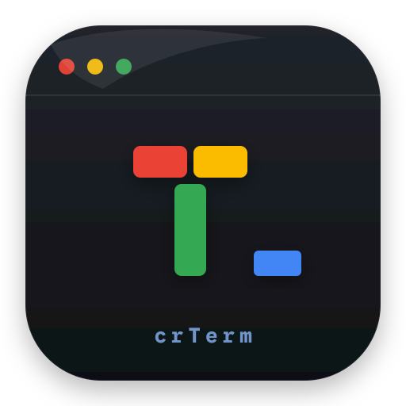
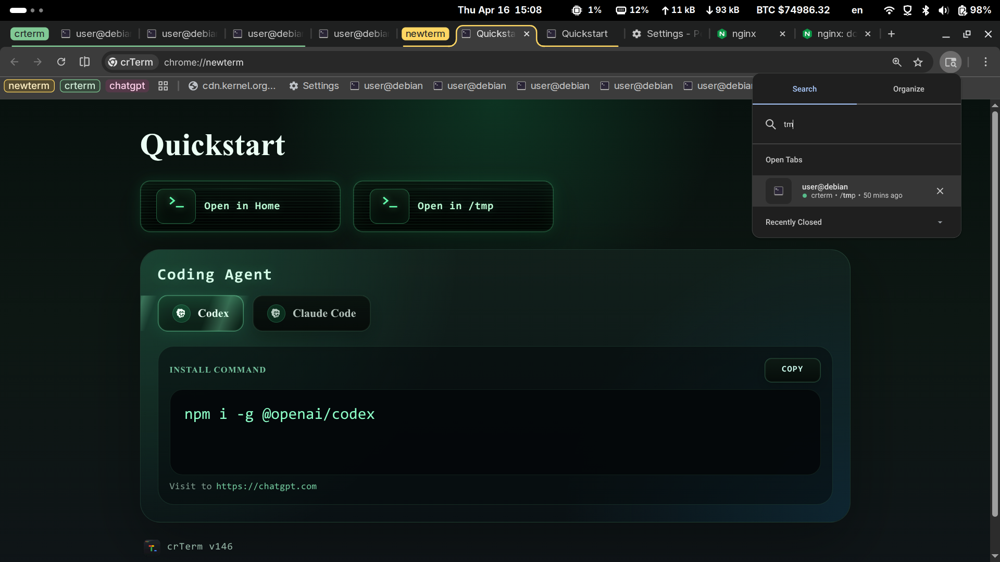
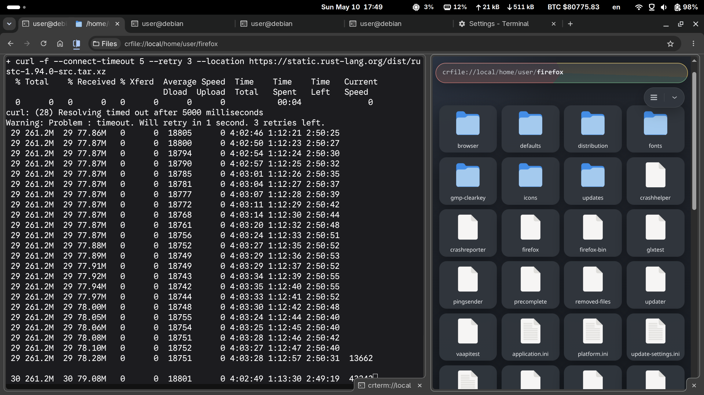
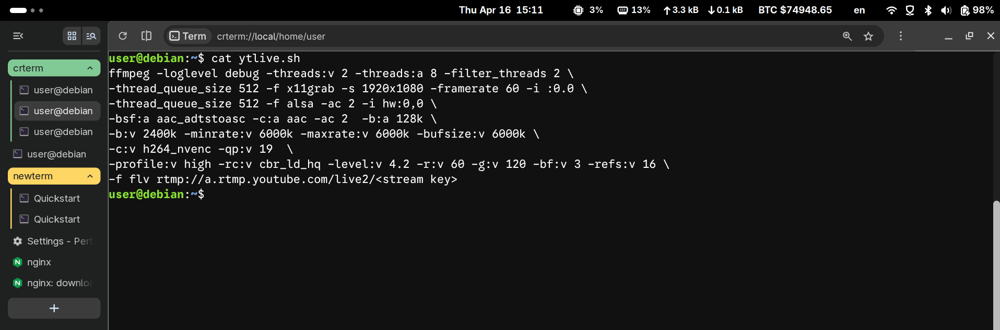

<h1>
  
  crTerm
</h1>

crTerm is a modern terminal experience built for the AI era.

It brings a real local shell into Chromium, gives terminal sessions the familiar feel of browser tabs, and delivers native-level performance through a C++ backend. crTerm is also designed to be extended with Chrome extensions, so terminal workflows can grow through the same extension model that already powers the browser.



## Why crTerm

crTerm makes the terminal a first-class browser surface:

- Open terminal sessions as Chrome tabs.
- Move between web pages and shells with the same tab model.
- Use browser tab group, history, bookmark, and session restore.
- Click links from terminal output and continue in the browser.
- Keep project terminals close to the documentation, dashboards, repositories, and online tools you already use.

crTerm is a browser-native terminal experience backed by native integration.

## Key Ideas

### Browser-Style Terminal Experience

crTerm makes terminal sessions feel like Web Browser:

- Use Chrome's powerful tab management for multiple terminal sessions.
- Customize the terminal with rich theme and appearance settings.
- Search terminal output with `Ctrl+F` or `Cmd+F`.
- Open HTTPS links from terminal output in new browser tabs.
- Restore previous terminal output when restore is enabled.
- Configure terminal preferences through the browser profile.



### Native Performance in C++

crTerm is implemented with Chromium-native components and a C++ terminal PTY backend.

That means:

- Real local shell processes.
- Native process and terminal I/O handling.
- Fast startup and responsive input handling.
- Tight integration with Chromium WebUI, Mojo, preferences, and browser lifecycle.
- A terminal surface that feels browser-native without giving up native execution.

### Extensible with Chrome Extensions

crTerm supports Chrome extensions, making it possible to extend terminal behavior and browser-terminal workflows.

You can build features around the terminal using familiar browser extension patterns, such as:

- Project-specific terminal helpers.
- Workflow automation.
- Developer tools integration.
- Context-aware commands.
- Browser UI that works alongside terminal sessions.

The goal is for crTerm to be more than a fixed terminal application. It is a terminal platform that can be customized and expanded like the browser itself.



## Common Usage

Open crTerm and use it like a normal terminal:

```bash
pwd
ls
cd ~/dev/my-project
git status
npm test
```

## Features

- **Browser-native workflow**: terminal sessions live in Chromium tabs.
- **Real shell access**: commands run through the local system shell, backed by PTY/ConPTY integration.
- **C++ native backend**: terminal process handling and browser integration are implemented with native Chromium components.
- **Chrome extension support**: extend terminal workflows through Chrome extensions.
- **Clickable output links**: HTTPS links in terminal output open directly in the crTerm.
- **Output restore**: previous terminal output can be restored across sessions.
- **Customizable appearance**: configure shell, theme, font, font size, scrollback, and restore behavior.

## Project Vision

crTerm aims to become the modern terminal for the AI era. It gives developers, product managers, creators, and designers a first-class interactive experience, making the terminal feel as familiar and approachable as the browser.
